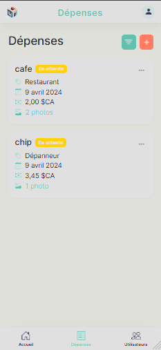
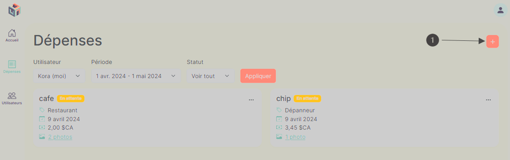

# User with the administrator role or Expense Management

## Menu

Click on the icon representing an invoice with the label **"Expenses"** below it.

- You will be directed to a page displaying all your previously recorded expenses, if any, and the icon will change color to indicate that you are on this page.

- By default, you will view your expenses for the current month in the form of cards with a label indicating the current status of your expense.

#### _Desktop application_

#### _Mobile application_

## Filter

Apply filters to view expenses from users within your organization:

**\*For the mobile application, you need to click on the button to the left of the button with the + sign to bring up a pop-up window containing the filters.**

- a. Click on the dropdown menu below **"User"** to select the user whose expenses you want to examine.
- b. Click on the dropdown menu below **"Period"** to select the month you wish to examine expenses for.
  - You have the option to choose expenses dating back up to five years before the current month, but up to the maximum date of January 1, 2024.
- c. Click on the dropdown menu below **"Status"** to select the status of expenses you wish to examine. The "View all" filter includes all expenses of the selected user for the states **"Approved"**, **"Rejected"**, and **"Pending"**.
- d. Click on **"Apply"** to apply the filters.

#### _Desktop application_

#### _Mobile application_

## Create an expense

1.  Press the icon shaped like a plus sign located in the top right corner of the window.

    - A dropdown menu will appear scrolling from right to left for a desktop application and from bottom to top for a mobile application.

    

2.  Fill in all fields marked with a red asterisk in their label in the form.

    - Make sure to select the user for whom you want to create an expense.

3.  Click on **"Create"**.

    - You will receive a green-colored notification at the bottom of the page, indicating **"Expense created successfully"**.
    - The **"Expenses"** page will display a new card containing the previously entered information for the expense

4.  If you click on **"Cancel"** or anywhere outside the form, all changes made in the form will be discarded, and the expense will not be created.

    

## Modify the status of an expense

1. Click on the three dots in the upper right corner.
2. Select between **"Approve"**, **"Reject"**, **"Archive"**.

   - If you select **"Approve"**, the label next to the expense name will change to **"Approved"** instead of **"Pending"**.
   - If you select **"Reject"**, the label next to the expense name will change to **"Rejected"** instead of **"Pending"**.

   

   - If you select **"Archive"**, the label next to the expense name will change to **"Archived"** instead of **"Pending"**, and the expense will no longer appear on the **"Expenses"** page. To view archived expenses, you need to apply the filter with the status **"Archived"**.

   

## Modify an expense

1. Click on the three dots in the upper right corner.
2. Select and click on **"Edit"**.
   - A dropdown menu will appear scrolling from right to left for a desktop application and from bottom to top for a mobile application.
3. Make the desired changes to the field in the form.
4. Click on **"Save"**.
   - You will receive a green-colored notification at the bottom of the page, indicating **"Expense saved successfully"**.
5. If you wish to cancel all changes made, you can click on **"Cancel"** or anywhere outside the form.

   
   

## Delete an expense

1. Click on the three dots in the top right corner.
2. Select and click on **" Delete "**.
   - A drop-down menu will appear scrolling from right to left for a desktop application and from bottom to top for a mobile application.
3. Click on **" Delete "**.
4. If you want to cancel the deletion of the expense, you can click on **" Cancel "** or anywhere outside the form.

   
   
