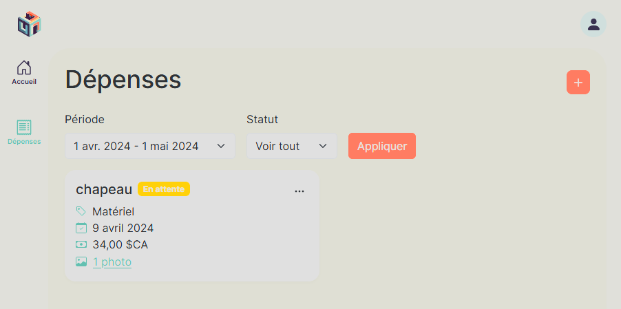
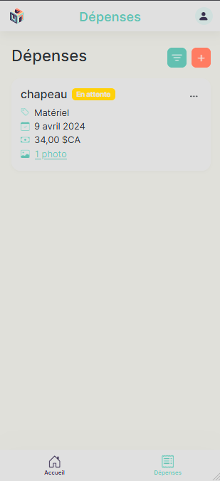
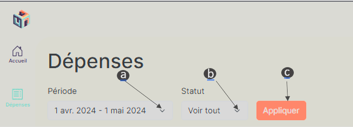
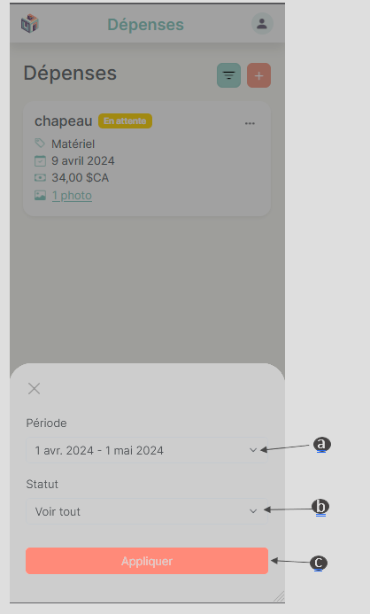
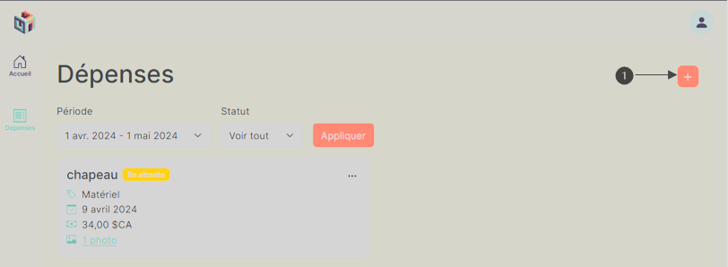
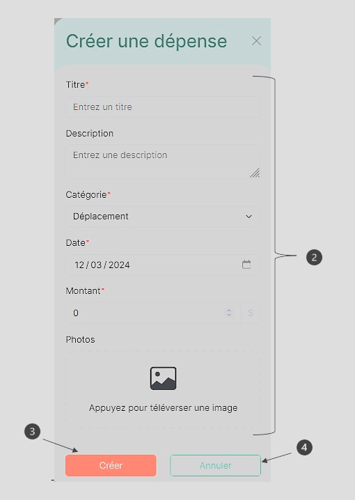
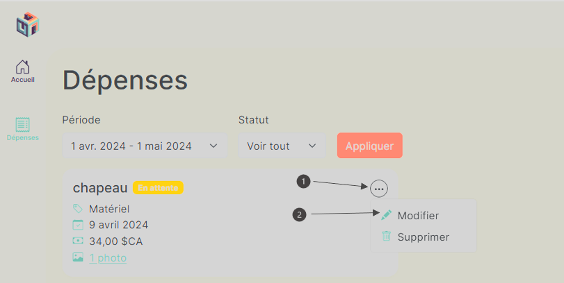
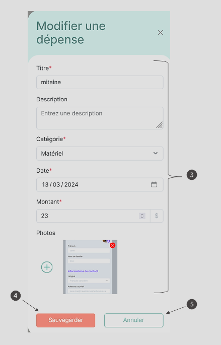
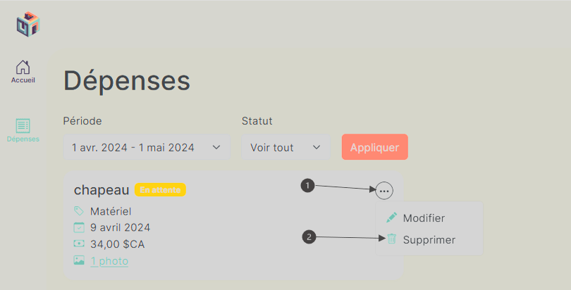
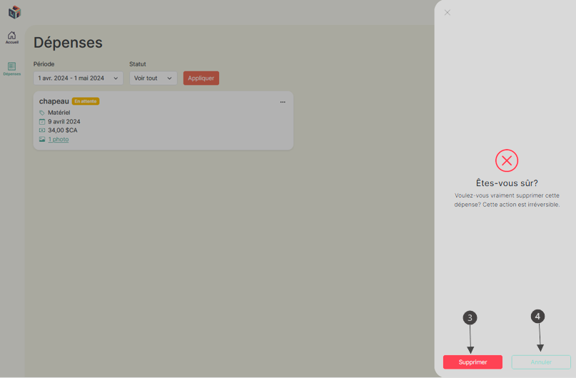

# User without a role

## Menu

Click on the icon depicting an invoice with the label **" Expenses "** below.

- You will be directed to a page displaying all your previously recorded expenses, if any, and the icon will change color to indicate that you are on this page.

- By default, you will view your expenses for the current month in the form of cards with a label indicating the current status of your expense.

#### _Desktop application_

#### _Mobile application_

## Filter

Apply filters to view expenses from users within your organization:

**\*For the mobile application, you need to click on the button to the left of the button with the + sign to bring up a pop-up window containing the filters.**

- a. Click on the dropdown menu below **"Period"** to select the month you wish to examine expenses for.
  - You have the option to choose expenses dating back up to five years before the current month, but up to the maximum date of January 1, 2024.
- b. Click on the dropdown menu below **"Status"** to select the status of expenses you wish to examine. The "View all" filter includes all expenses of the selected user for the states **"Approved"**, **"Rejected"**, and **"Pending"**.
- c. Click on **"Apply"** to apply the filters.

#### _Desktop application_

#### _Mobile application_

## Create an expense

1.  Press the plus sign icon located in the top right corner of the window.

    - Un menu déroulant défilant de droite à gauche apparaîtra pour une application bureau et de bas vers le haut pour une application mobile.

    

2.  You must fill in all fields marked with a red asterisk in their label in the form.
3.  Click on **" Create "**.

    - You will receive a green-colored notification at the bottom of the page, indicating **" Expense created successfully "**.
    - The **" Expenses '** page will display a new card containing the previously entered information for the expense.

4.  If you click on **" Cancel "** or anywhere outside the form, all changes made in the form will be discarded, and the expense will not be created.

    

## Modify an expense

1. Click on the three dots in the top right corner.
2. Select and click on **" Edit "**.
   - A drop-down menu will appear scrolling from right to left for a desktop application and from bottom to top for a mobile application.
3. Make the desired modification in the form field
4. Click on **" Save "**.
   - You will receive a green-colored notification at the bottom of the page, indicating **" Expense saved successfully "**.
5. If you want to cancel all changes made, you can click on **" Cancel "** or anywhere outside the form.

   
   

## Delete an expense

1. Click on the three dots in the top right corner.
2. Select and click on **" Delete "**.
   - A drop-down menu will appear scrolling from right to left for a desktop application and from bottom to top for a mobile application.
3. Click on **" Delete "**.
4. If you want to cancel the deletion of the expense, you can click on **" Cancel "** or anywhere outside the form."

   
   
