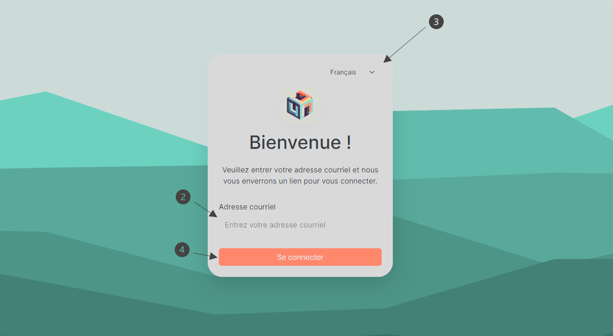
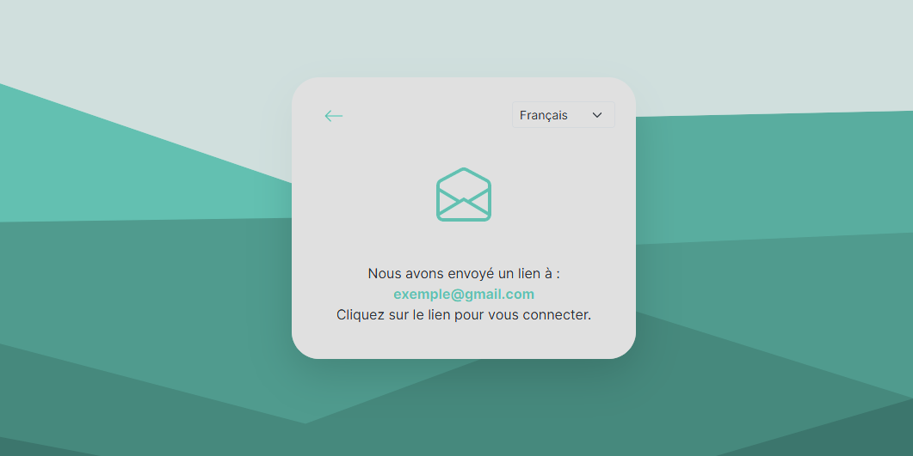

# Log in to your user account

1. To log in, go to the website.
2. Please enter your email address in the designated field.
3. Please ensure that the language used in the application matches your preference. By default, the application language is set to French.
   - You can adjust this by clicking on the language option located at the top right of the welcome window and selecting the language you wish to use.
4. Click on **" Sign in "**.

   

5. A new window will appear to inform you that an email has been sent to the address you provided in step 2. You will need to log in to your email inbox to access the message containing the necessary link.

   

6. Once in your email inbox, look for an email with the name **" noreply "**.
7. Click on the link in the email.

   
