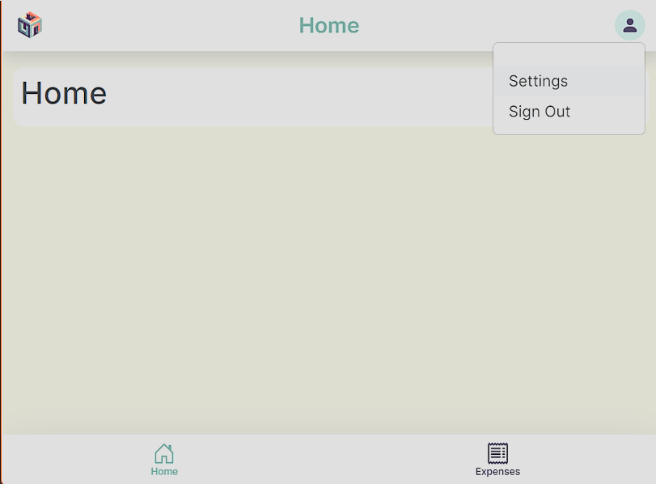
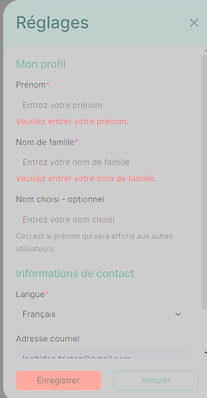

# User settings modification

1. To open the settings, you need to press the icon in the top right corner and then press **" Settings "**.

   

2. In the settings, you can modify your First Name, Last Name, Nickname (Preferred Name), and your preferred language. Just press **" Save "** to save the changes.

   
