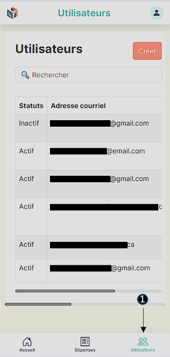
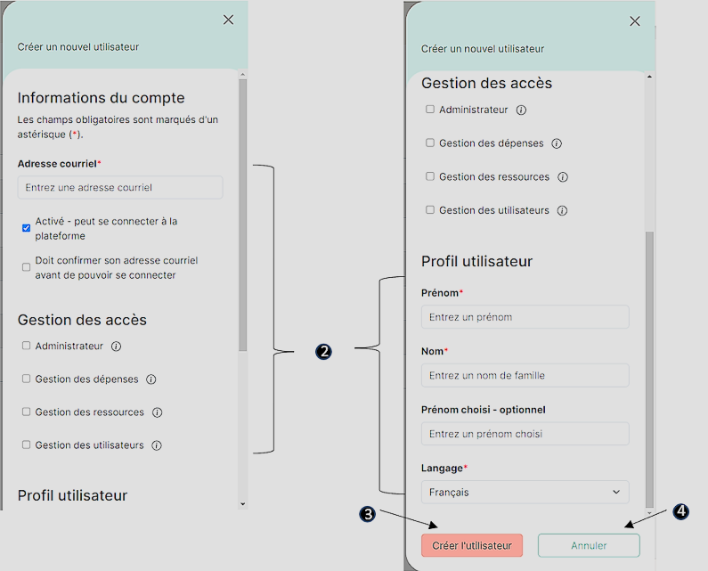
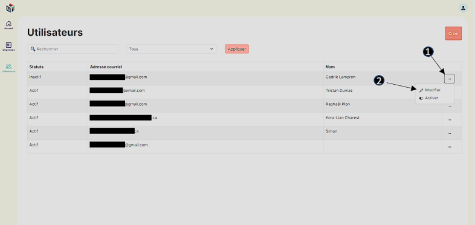
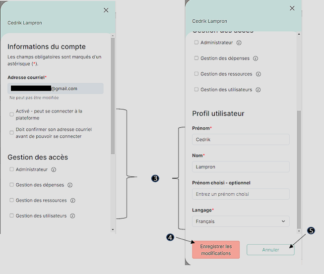
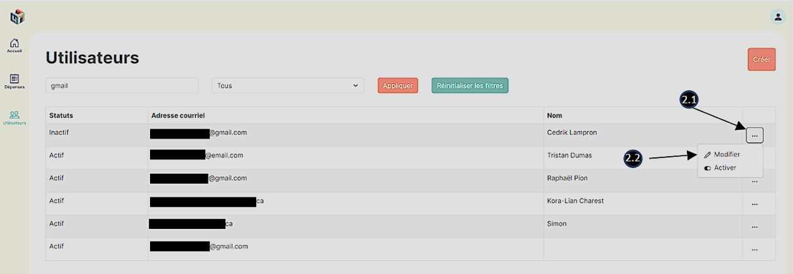
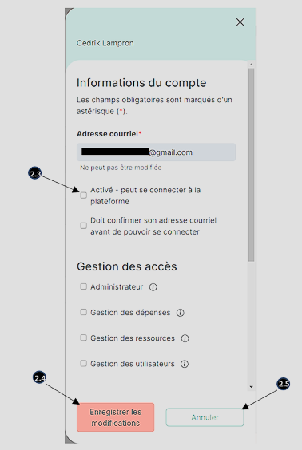

# User module

**_\*Email addresses will be hidden for privacy reasons._**

## Menu

1. Click on the icon depicting users with the label **"Users"** below.

   - You will be directed to a page displaying the list of users registered in the application, and the icon will change color to indicate that you are on this page.

#### _Desktop application_

#### _Mobile application_

## Create an user

1. Press the **"Create"** button located in the top right corner of the window.

   - A dropdown menu will appear scrolling from right to left for a desktop application and from bottom to top for a mobile application.

   

2. It is mandatory to fill in all fields marked with a red asterisk in their label on the form.
3. Click on **"Create User"**
   - You will receive a green-colored notification at the bottom of the page, indicating **"The user has been successfully created."**
   - The **"Users"** page will display a new row in the user table containing the status, email address, and full name of the new user.
4. If you click on **"Cancel"** or anywhere outside the form, all changes made in the form will be discarded, and the user will not be created.

   

## Modify an user

1. Click on the three dots **"..."** in the last column of the row containing the user to be modified.
2. Select and click on **"Edit"**.

   - A dropdown menu will appear scrolling from right to left for a desktop application and from bottom to top for a mobile application.

3. Make the desired changes to the field(s) in the form.

   - The email address cannot be modified, and some other fields may not be editable depending on your permissions.

4. Click on **"Save Changes"**.

   - You will receive a green-colored notification at the bottom of the page, indicating **"The user has been successfully saved."**

5. If you want to cancel all changes made, you can click on **"Cancel"** or anywhere outside the form.

   
   

## Deactivate/activate an user

1. Method 1 (directly in the table) :

   - 1.1 Click on the three dots **"..."** in the last column of the row containing the user to deactivate/activate.
   - 1.2 Select and click on **"Deactivate"** or **"Activate"** depending on the current status of the user
     - You will receive a green-colored notification at the bottom of the page, indicating **"The user's status has been successfully changed"**.

   

2. Method 2 (in the form) :

   - 2.1 Click on the three dots **"..."** in the last column of the row containing the user to deactivate/activate.
   - 2.2. Select and click on **"Edit"**.
   - 2.3. Check or uncheck the **"Enabled - can log in to the platform"** checkbox according to the user's current status.
   - 2.4. Click on **"Save Changes"**.
   - 2.5. If you want to cancel the status change, you can click on **"Cancel"** or anywhere outside the form.

   
   

## Filter and Search

1. Applying filters to the list of users:
   - a. Enter a string of characters in the search bar to filter the list according to users containing these characters in their name or email address.
   - b. Click on the dropdown menu **"All"** to select between **"Active"**, **"Inactive"**, and **"All"** to filter users according to their status (the "All" filter includes both inactive and active users).
   - c. Click on **"Apply"** to apply the filters.
2. Click on **"Reset Filters"** to get the complete list without any filters.

   
