# Utilisateur avec le rôle administrateur ou Gestion des dépenses

## Menu

Cliquez sur l’icône représentant une facture avec le libellé **« Dépenses »** en dessous.

- Vous serez dirigé vers une page affichant toutes vos dépenses déjà enregistrées, le cas échéant, et l'icône changera de couleur pour indiquer que vous êtes sur cette page.

- Par défaut, vous percevriez vos dépenses du mois actif sous forme de carte avec un étiquette qui indique le statut actuel de votre dépense.

#### _Application bureau_

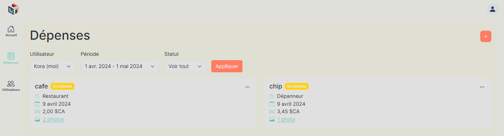

#### _Application mobile_

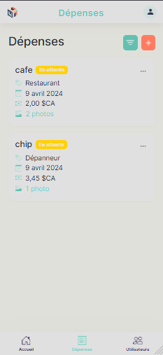

## Filtre

Appliquer des filtres pour voir les dépenses des utilisateurs de votre organisation :

**\*Pour l'application sur mobile, il faut cliquer sur le bouton à gauche du bouton avec le + pour faire apparaitre une denêtre ouvrante contenant les filtres.**

- a. Cliquez sur le menu déroulant en dessous de **« Utilisateur »** pour sélectionner l'utilisateur que vous souhaitez examiner ses dépenses effectuées.
- b. Cliquez sur le menu déroulant en dessous de **« Période »** pour sélectionnner le mois que vous désirez examiner les dépenses.
  - Vous avez la possibilité de choisir une dépense datant jusqu'à cinq ans avant le mois actuel, mais jusqu'à la date maximal du 1er janvier 2024.
- c. Cliquer sur le menu déroulant en dessous de **« Statut »** pour sélectionnner statut des dépenses que vous désirez examiner les dépenses.Le filtre **« Voir tout »** inclut toutes les dépenses de l'utilisateur sélectionné pour les états **« Approuvée »**, **« Refusée »** et **« En attente »**.
- d. Cliquez sur **« Appliquer »** pour appliquer les filtres.

#### _Application bureau_

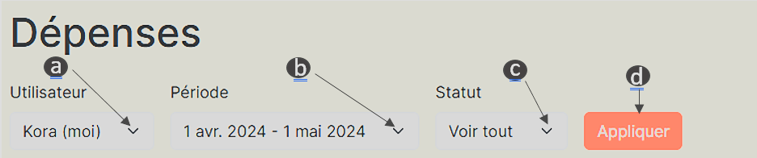

#### _Application mobile_

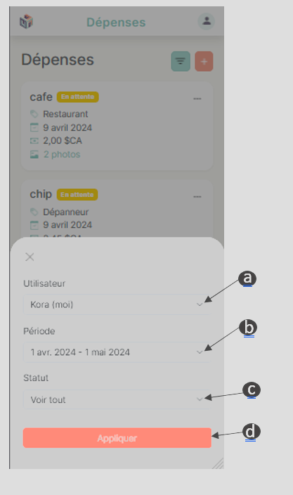

## Créer une dépense

1.  Appuyez sur l'icône en forme de signe plus située dans le coin supérieur droit de la fenêtre.

    - Un menu déroulant défilant de droite à gauche apparaîtra pour une application bureau et de bas vers le haut pour une application mobile.

    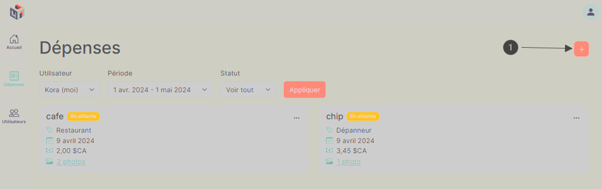

2.  Remplir obligatoirement tous les champs marqués d’un astérisque rouge dans leur libellé dans le formulaire.

    - S'assurer de bien sélectionner l'utilisateur qu'on veut créer une dépense.

3.  Cliquez sur **« Créer »**.

    - Vous recevrez une notification de couleur verte en bas de la page, vous indiquan **« La dépense a été créée avec succès »**.
    - La page **« Dépenses »** affichera une nouvelle carte contenant les informations entrer précédemment pour la dépense.

4.  Si vous cliquez sur **« Annuler »** ou n’importe où en dehors du formulaire, toutes les modifications effectuées dans le formulaire seront supprimées et la dépense ne sera pas créée.

    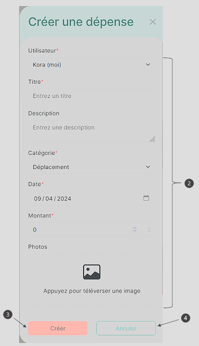

## Modifier le statut d'une dépense

1. Cliquez sur les trois petits points dans le coin supérieur à droite.
2. Sélectionner entre **« Approuver »**, **« Refuser »**, **« Archiver »**.

   - Si vous sélectionnez **« Approuver »**, l'étiquette à côté du nom de la dépense va changé pour **« Approuvée »** au lieu de **« En attente »**.
   - Si vous sélectionnez **« Refuser »**, l'étiquette à côté du nom de la dépense va changé pour **« Refusée »** au lieu de **« En attente »**.

   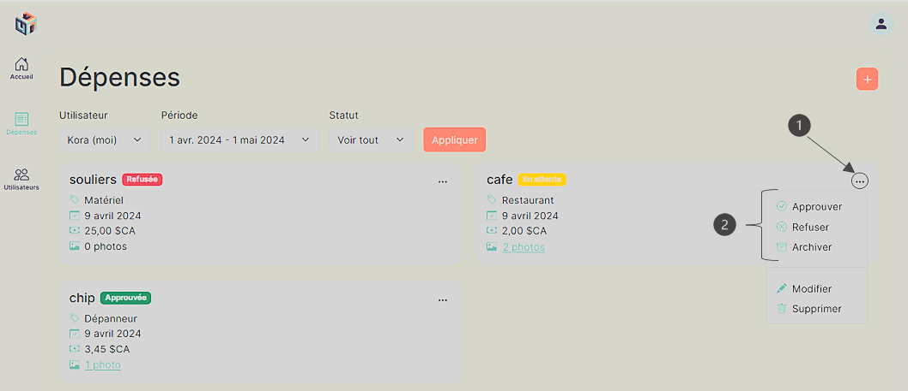

   - Si vous sélectionnez **« Archiver »**, l'étiquette à côté du nom de la dépense va changé pour **« Archivée »** au lieu de **« En attente »** et la dépense n'apparaîtera plus dans la page de **« Dépenses »**.Pour pouvoir regarder les dépenses qui sont archivée, il faut appliquer le filtre avec le statut **« Archivée »**.

   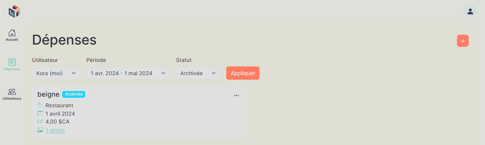

## Modifier un dépense

1. Cliquez sur les trois petits points dans le coin supérieur à droite.
2. Sélectionnez et cliquez sur **« Modifier »**.
   - Un menu déroulant défilant de droite à gauche apparaîtra pour une application bureau et de bas vers le haut pour une application mobile.
3. Effectuez la modification du champ souhaité dans le formulaire.
4. Cliquez sur **« Sauvegarder '**.
   - Vous recevrez une notification de couleur verte en bas de la page, vous indiquant **« La dépense a été sauvegardée avec succès »**.
5. Si vous voulez annulez toutes modifications effectuées, vous pouvez cliquer sur **« Annuler »** ou n’importe où en dehors du formulaire.

   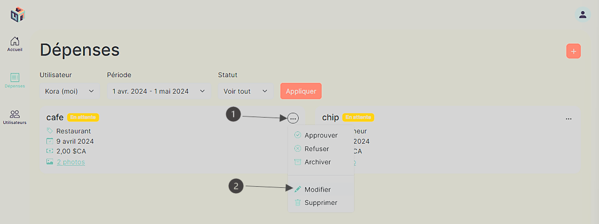
   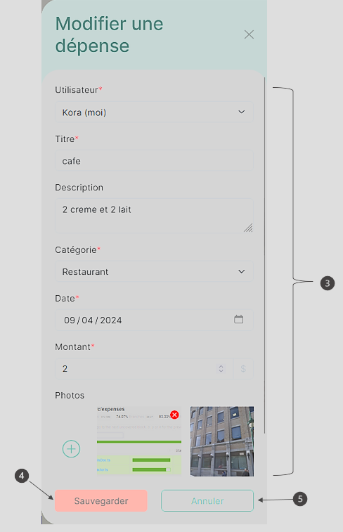

## Supprimer une dépense

1. Cliquez sur les trois petits points dans le coin supérieur à droite.
2. Sélectionnez et cliquez sur **« Supprimer »**.
   - Un menu déroulant défilant de droite à gauche apparaîtra pour une application bureau et de bas vers le haut pour une application mobile.
3. Cliquez sur **« Supprimer »**.
4. Si vous voulez annulez la suppression de la dépense, vous pouvez cliquer sur **« Annuler »** ou n’importe où en dehors du formulaire."

   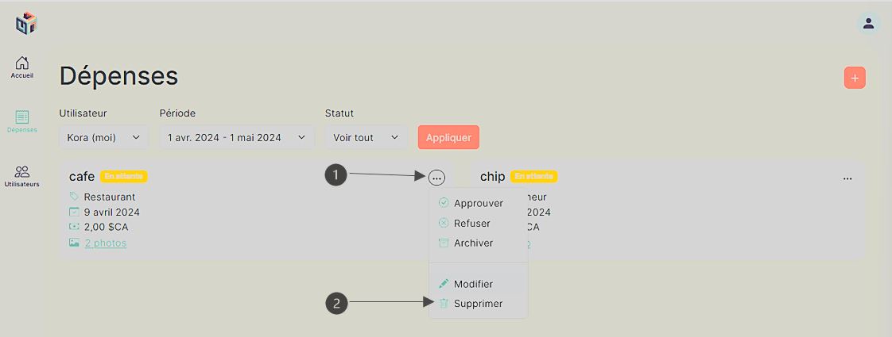
   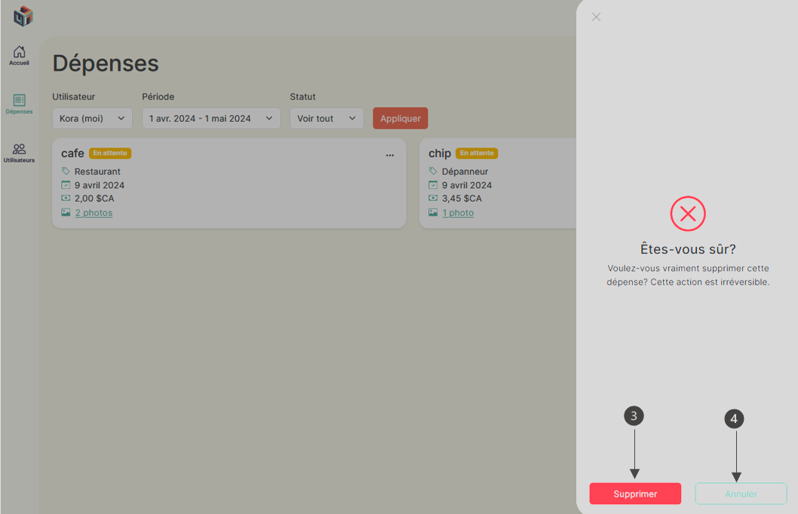
