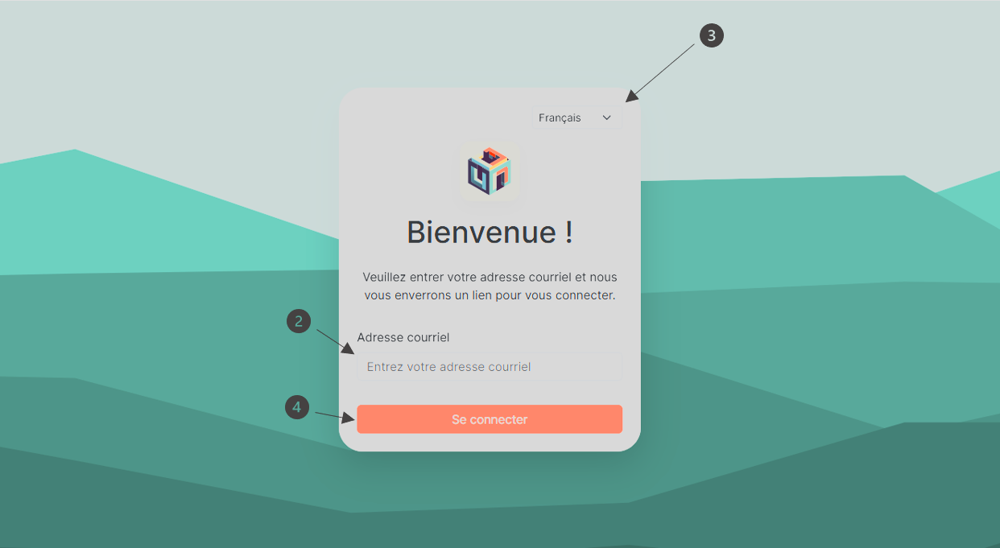
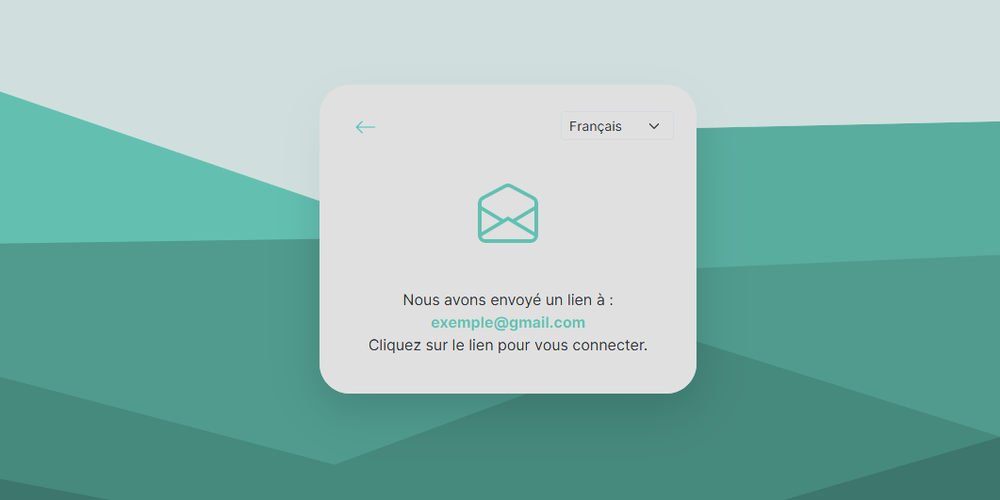
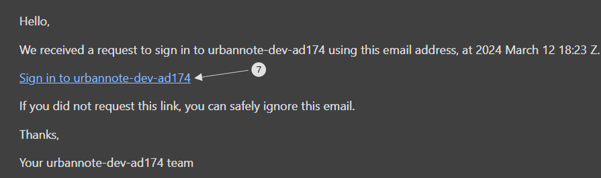

# Se connecter a votre compte UrbanNote

1. Pour vous connecter, rendez-vous sur le site.
2. Veuillez saisir votre adresse courriel dans le champ prévu à cet effet.
3. Veuillez vérifier que la langue utilisée dans l'application correspond à celle de votre choix. Par défaut, la langue de l'application est définie sur le français.
   - Vous pouvez ajuster cela en cliquant sur l'option de langue située en haut à droite de la fenêtre de bienvenue et sélectionner la langue de vous souhaiter utiliser.
4. Cliquez sur **« Se connecter »**.

   

5. Une nouvelle fenêtre apparaîtra pour vous informer qu'un courriel a été envoyé à l'adresse que vous avez fournie à l'étape 2. Vous devrez alors vous connecter à votre boîte de réception courriel pour accéder au message contenant le lien nécessaire.

   

6. Une fois dans votre boîte de réception de courriel, recherchez un courriel avec le nom **« noreply »**.
7. Cliquez sur le lien dans le courriel

   
