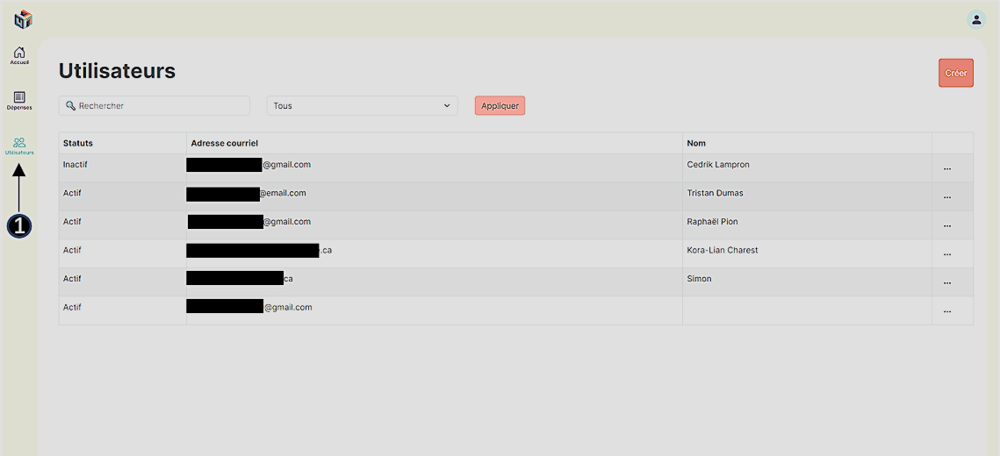
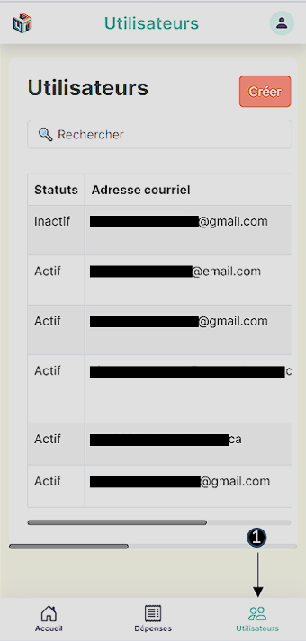
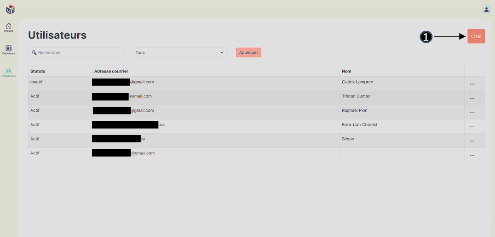
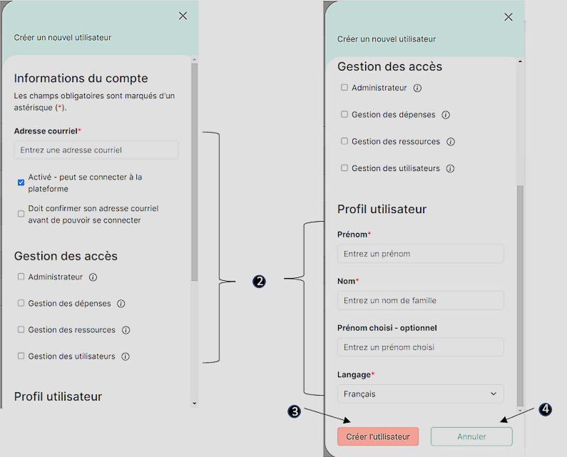
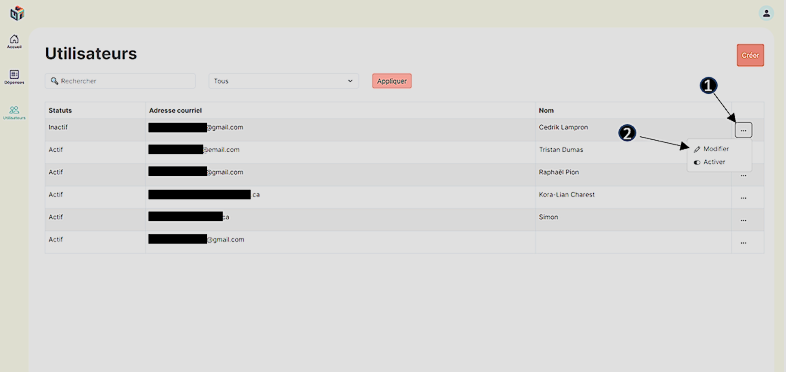
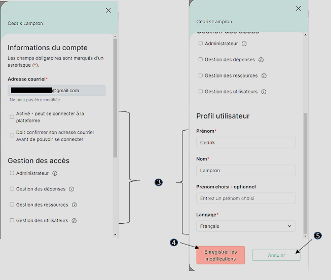
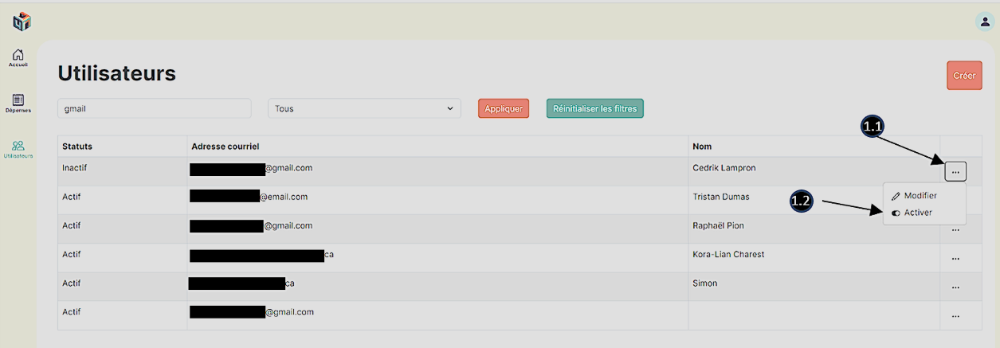
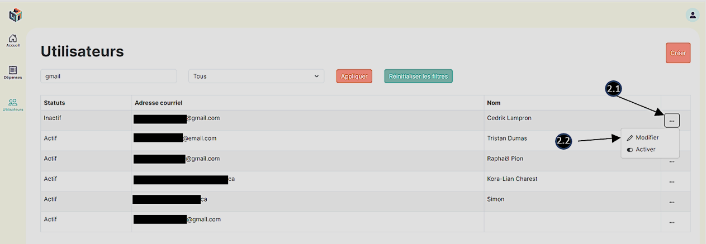
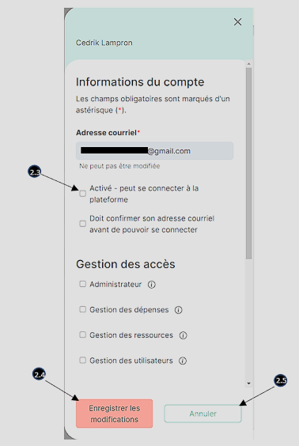
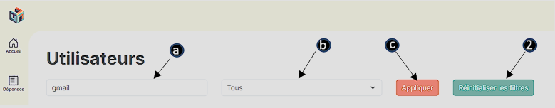

# Section utilisateurs

**_\*Les adresses courriel seront cachées par soucis de confidentialité_**

## Menu

1. Cliquez sur l’icône représentant des utilisateurs avec le libellé **« Utilisateurs »** en dessous.
   - Vous serez dirigé vers une page affichant la liste des utilisateurs enregistrés dans l’application, et l'icône changera de couleur pour indiquer que vous êtes sur cette page.

#### _Application bureau_

#### _Application mobile_

## Créer un utilisateur

1. Appuyez sur le bouton **« Créer »** situé dans le coin supérieur droit de la fenêtre.

   - Un menu déroulant défilant de droite à gauche apparaîtra pour une application bureau et de bas vers le haut pour une application mobile.

   

2. Remplir obligatoirement tous les champs marqués d’un astérisque rouge dans leur libellé dans le formulaire.
3. Cliquez sur **« Créer l’utilisateur »**
   - Vous recevrez une notification de couleur verte en bas de la page, vous indiquant **« L'utilisateur a été créé avec succès »**.
   - La page **« Utilisateurs »** affichera une nouvelle ligne dans le tableau des utilisateurs contenant le statut, l’adresse courriel ainsi que le nom complet du nouvel utilisateur.
4. Si vous cliquez sur **« Annuler »** ou n’importe où en dehors du formulaire, toutes les modifications effectuées dans le formulaire seront supprimées et l’utilisateur ne sera pas créé.

   

## Modifier le profil d'un utilisateur

1. Cliquez sur les trois petits points **« … »** dans la dernière colonne de la ligne contenant l’utilisateur à modifier.
2. Sélectionnez et cliquez sur **« Modifier »**.

   - Un menu déroulant défilant de droite à gauche apparaîtra pour une application bureau et de bas vers le haut pour une application mobile.

3. Effectuez la modification du ou des champs souhaités dans le formulaire.

   - L’adresse courriel ne peut être modifiée et certains autres champs peuvent ne pas être modifiables selon vos permissions.

4. Cliquez sur **« Enregistrer les modifications »**.

   - Vous recevrez une notification de couleur verte en bas de la page, vous indiquant **« L'utilisateur a été enregistré avec succès »**.

5. Si vous voulez annuler toutes modifications effectuées, vous pouvez cliquer sur **« Annuler »** ou n’importe où en dehors du formulaire.

   
   

## Désactivation/activation d'un utilisateur

1. Méthode 1 (directement dans le tableau) :

   - 1.1 Cliquez sur les trois petits points **« … »** dans la dernière colonne de la ligne contenant l’utilisateur à désactiver/activer.
   - 1.2 Sélectionnez et cliquez sur **« Désactiver »** ou **« Activer »** selon le statut actuel de l’utilisateur.
     - Vous recevrez une notification de couleur verte en bas de la page, vous indiquant **« Le statut de l'utilisateur a été modifié avec succès »**.

   

2. Méthode 2 (dans le formulaire) :

   - 2.1 Cliquez sur les trois petits points **« … »** dans la dernière colonne de la ligne contenant l’utilisateur à désactiver/activer.
   - 2.2. Sélectionnez et cliquez sur **« Modifier »**.
   - 2.3. Cocher ou décocher selon le statut actuel de l’utilisateur la case **« Activé – peut se connecter à la plateforme »**.
   - 2.4. Cliquez sur **« Enregistrer les modifications »**.
   - 2.5. Si vous voulez annuler la modification de statut, vous pouvez cliquer sur « Annuler » ou n’importe où en dehors du formulaire.

   
   

## Filtre et recherche

1. Appliquer des filtres à la liste des utilisateurs :
   - a. Entrez une chaine de caractères dans la barre de recherche afin de filtrer la liste selon les utilisateurs qui contiennent ces caractères dans leur nom ou leur adresse courriel.
   - b. Cliquez sur le menu déroulant **« Tous »** pour sélectionner entre **« Actif »**, **« Inactif »** et **« Tous »** afin de filtrer les utilisateurs selon leur statut (le filtre **« Tous »** inclut les utilisateurs inactifs et actifs).
   - c. Cliquez sur **« Appliquer »** pour appliquer les filtres.
2. Cliquez sur **« Réinitialiser les filtres »** afin d’obtenir la liste complète sans filtre.

   
